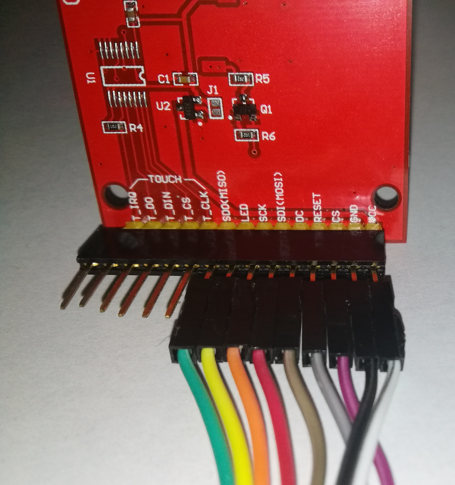
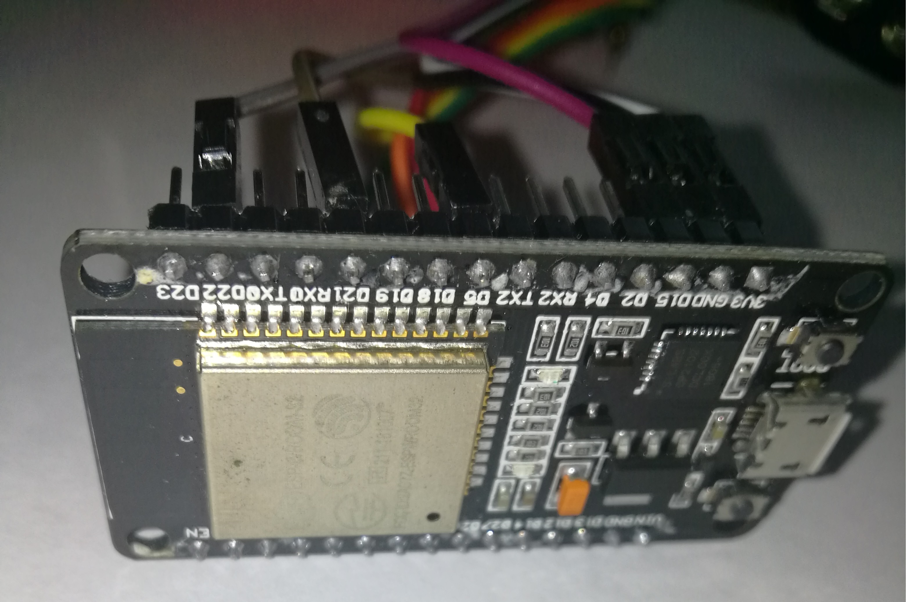
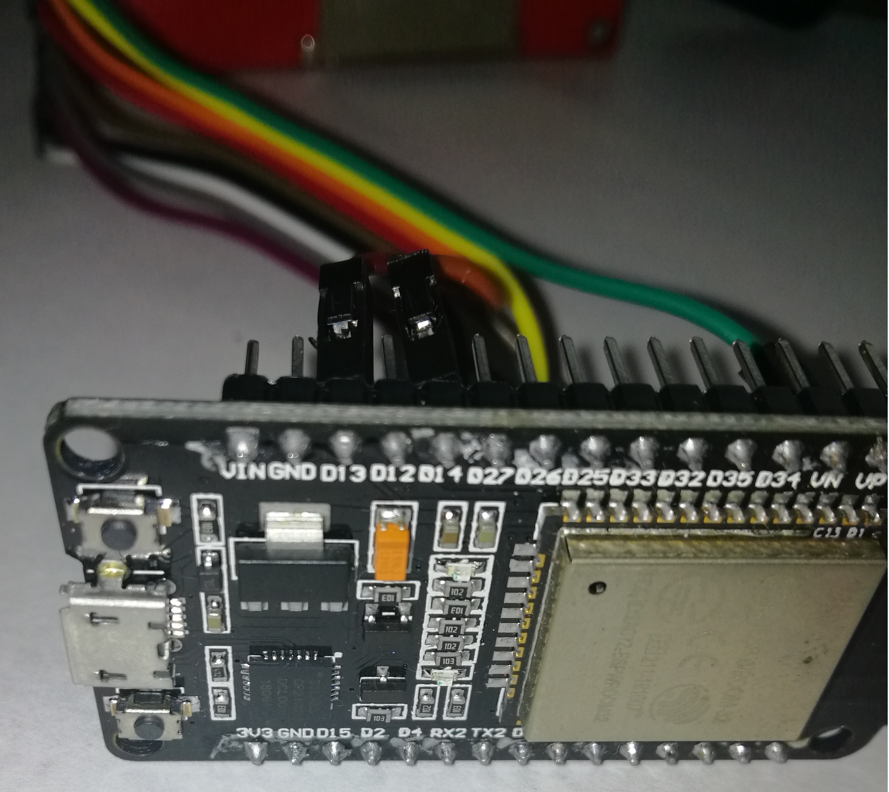

## *Load an image bitmap via COM port and display it on LCD (ILI9341)*
The following example demonstrates how to load any image via UART0 (onboard USB-TTL on esp32) that is usually an onboard USB to TTL connection so it is easier for user to connect Esp device right away.

## Setup and Test Guide

- [Hardware parts](#hardware-parts)
   - [LCD 320x240 ILI9341 (SPI)](#lcd-display)
   - [ESP32 Board](#esp32-board)
- [Code of windows app and esp firmware](#code-of-windows-app-and-esp-firmware)
   - [WPF Application in C#](#wpf-application-c)
   - [IDF Project in C/C++](#idf-project)
- [Connect Pins](#connect-pins)
- [Compile code](#compile-code)
- [Run and Test](#run-and-test)

- [How it works](#how-it-works)

## Hardware Parts

### LCD Display

I used a popular TFT 32x240 ILI9341 display with SPI interface

### ESP32 Board

ESP32 module used was brown WROOM board with 4Mb flash but you can use any board
like WROVER which will increase speed of transfer if you use PSI RAM (see notes)

## Code of Windows app and ESP firmware

We essentially need a client-server or client-client communication in this case  
The data from PC is sent after selecting an image from very simple picture list that points to your folder with pictures  
By clicking on the picture the image is instantly sent to ESP32  

### WPF Application (C#)
It is a very basic application based on WPF written in C#.NET  
The solution uses Visual Studio 2017 but feel welcome to upgrade or modify it so it compiles and works  

### IDF Project
The project follows code example included with idf framework. It uses CMake. The program awaits for UART event when COM data arrives from PC and sends it to TFT via SPI pins. 

## Connect Pins
<table ><tr><td>

| LCD | PIN |
| --- | --- |
| CS | 15 |
| MOSI | 13 |
| CLK | 14 |
| DC | 21 |
| RST | 22 |
| LED | 5 |
 
 </td><td>

</td></tr>
</table>

## Compile Code

Application tosend bitmap is compiled with Visual Studio 2017 as C# solution.  
Just load the project (.sln) and run debugging or execute binary exe included with the source code.  
Esp code requires CMake to compile - *idf.py -p COMX flash*  
**Important: Do not run monitor as it blocks the acces to the com port**  

## Run and Test
First just connect esp onboard usb to PC and make sure it is recognized  
Next run Windoes wpf app called UartTest and select your picture to be lozaded  
Note: it may take a second to load a full bitmap because UART is very slow  
115200 bits/s is only 14kb/s so be patient during load)

## How it works
In brief - windows app acts as a data server sending bytes instantly after clicking image.  
Esp program waits for an UART_DATA event and starts loading the bitmap in screen portions because of memory limits.  
It is defined as BLOCK_LINES which is DISPLAY_HEIGHT / (n). n is number of loaded image portions.
On 4Mb boards n>=2 however if you use PSRAM board n could be set to 1  
If BLOCK_LINES=DISPLAY_HEIGHT you get maximum performance.
I used 565 bitmap pixel format (Format16bppRgb565) which is sent already converted and resized on PC side.  
All the logging output is disabled and redirected to win app small port monitoring code.  
The monitor is very simple and because of ANSI standard being processed there might be some ascii artifacts.  
Feel free to experiment with the code - it may turn out to be usefull :wink:
